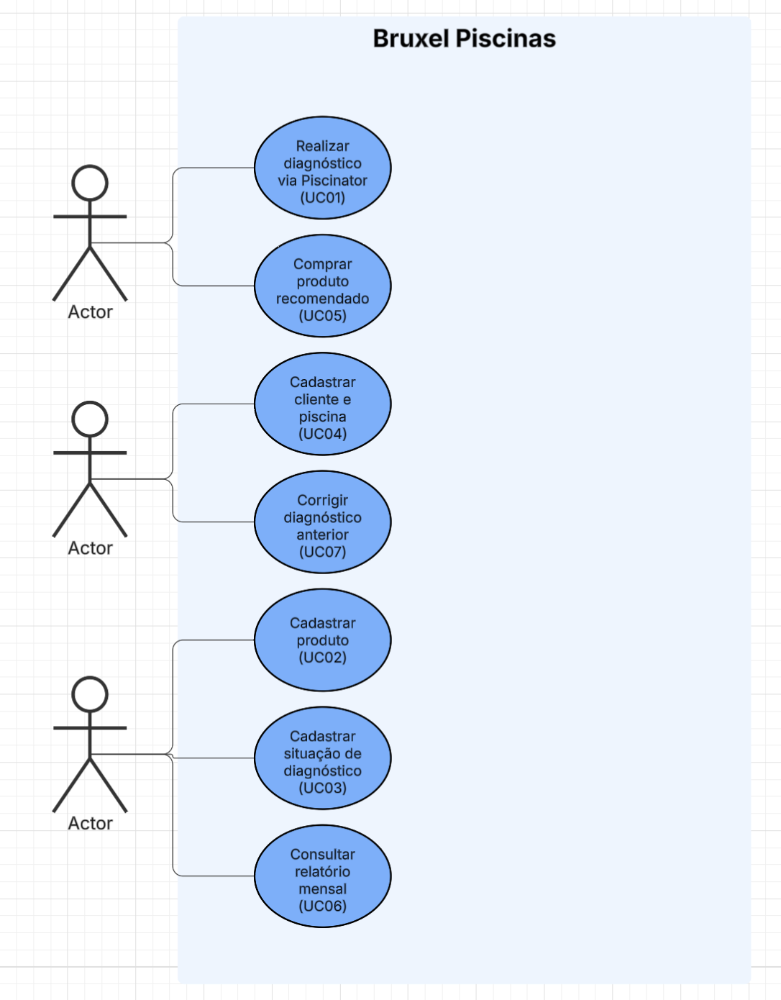
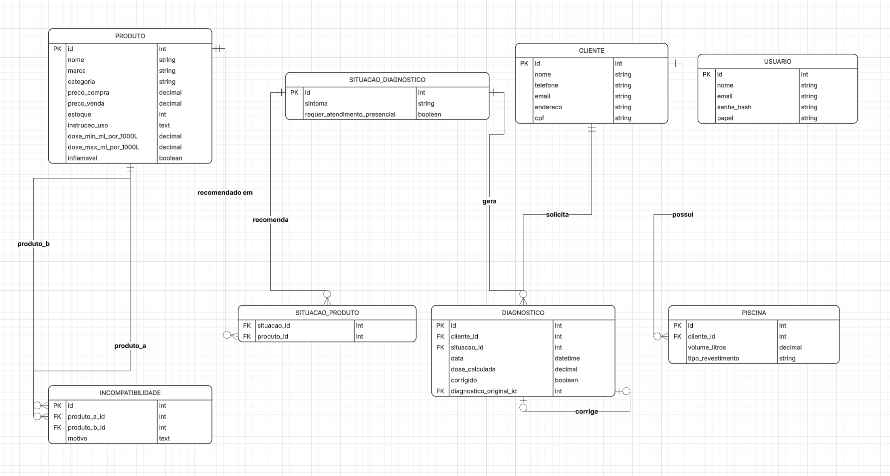

# PRD v1 — Sistema Bruxel Piscinas

## 1. Problema

A Bruxel Piscinas hoje não tem uma visão consolidada de vendas e prestação de serviços — não existe relatório mensal, o controle é manual/disperso entre o sistema da loja (produtos, preços, estoque) e uma planilha Excel separada só para as manutenções. Ao mesmo tempo, o conhecimento técnico que decide qual produto e qual dose recomendar para cada situação de piscina não está documentado em lugar nenhum: hoje qualquer funcionário pode montar essa recomendação, mas baseado em experiência pessoal, não em uma regra registrada — o próprio dono descreve o processo de dosagem como algo que às vezes erra ("é um processo químico, nunca será 100% exato") e precisa ser corrigido na tentativa seguinte.

Soma-se a isso uma dependência sazonal forte: o faturamento da loja física cai fora do verão, e o dono já identificou que um canal online ajudaria a vender o ano todo e captar clientes novos — hoje 50 a 60% das vendas já acontecem sem o cliente precisar ir até a loja (por telefone/WhatsApp), mas sem um site.

## 2. Solução

Um sistema com back-office para cadastro de produtos (incluindo instrução de uso e dose por litro, que hoje **não existe** documentado em nenhum lugar), cadastro das regras de diagnóstico (situação relatada → produtos recomendados → dose → alerta de incompatibilidade → necessidade ou não de visita presencial), cadastro de clientes e suas piscinas, e registro de cada diagnóstico/atendimento realizado. Esses cadastros alimentam duas frentes visíveis ao cliente final: o quiz **Piscinator** (autoatendimento que recomenda produto e dose) e a loja virtual. E alimentam uma frente visível só ao dono: um relatório mensal consolidado de vendas e atendimentos.

## 3. Escopo (visão geral)

Dentro do escopo desta entrega: cadastro de produtos, cadastro de regras de diagnóstico, cadastro de clientes/piscinas, fluxo do Piscinator (perguntas → recomendação → redirecionamento pra loja), listagem de produtos na loja virtual, relatório mensal simples, autenticação com papéis (administrador/funcionário/cliente). Detalhes do que fica de fora estão na seção 9.

## 4. Requisitos funcionais

| ID | Requisito |
|---|---|
| RF01 | O sistema deve permitir cadastrar, editar, listar e remover produtos, com nome, marca, categoria, preço de compra, preço de venda, estoque, instrução de uso e fórmula de dose (ml por litro/m³ de água). |
| RF02 | O sistema deve permitir marcar um produto como inflamável ou de manuseio sensível, exibindo um alerta de segurança sempre que ele aparecer numa recomendação. |
| RF03 | O sistema deve permitir cadastrar, editar, listar e remover pares de produtos incompatíveis (ex.: cloro e algicida no mesmo dia), com o motivo do impedimento. |
| RF04 | O sistema deve recusar o cadastro de uma situação de diagnóstico que recomende, ao mesmo tempo, dois produtos marcados como incompatíveis entre si. |
| RF05 | O sistema deve permitir cadastrar, editar, listar e remover situações de diagnóstico (sintomas: água verde, turva, com espuma, etc.), cada uma associada a um ou mais produtos recomendados. |
| RF06 | O sistema deve permitir marcar uma situação de diagnóstico como "requer atendimento presencial" (ex.: piscina muito verde ou sem tratamento há meses), impedindo que o Piscinator devolva uma recomendação de produto nesse caso. |
| RF07 | O Piscinator deve calcular a dose recomendada de um produto a partir do volume de piscina informado pelo cliente e da fórmula cadastrada no produto (ex.: clarificante = 3 a 6 ml por 1.000 L). |
| RF08 | O sistema deve permitir cadastrar, editar, listar e remover clientes, com nome, telefone, e-mail, endereço, CPF e o volume da piscina associada. |
| RF09 | O sistema deve registrar cada diagnóstico realizado pelo Piscinator (data, cliente quando identificado, situação relatada, produto(s) recomendado(s), dose calculada). |
| RF10 | O sistema deve permitir marcar um diagnóstico registrado como "corrigido/repetido" quando o funcionário reavaliar o caso e ajustar produto ou quantidade, mantendo o histórico do diagnóstico original. |
| RF11 | O sistema deve gerar um relatório mensal consolidado de vendas e atendimentos realizados, filtrável por período (mês/ano). |
| RF12 | O sistema deve permitir que o cliente visualize os produtos recomendados pelo Piscinator na loja virtual e os adicione ao carrinho. |
| RF13 | O sistema deve restringir o acesso aos dados de cadastro de cliente (CPF, endereço, telefone) a usuários autenticados com papel de administrador ou funcionário. |
| RF14 | O sistema deve autenticar usuários com papéis distintos: administrador (cadastra produto/regra/preço), funcionário (cadastra cliente, consulta diagnóstico) e cliente (usa o Piscinator e a loja). |

## 5. Requisitos não funcionais

| ID | Requisito |
|---|---|
| RNF01 | O sistema deve recusar exibir CPF, endereço completo e telefone do cliente em qualquer rota acessível sem autenticação, retornando erro 401/403. |
| RNF02 | Senhas de usuários administradores e funcionários devem ser armazenadas com hash (bcrypt ou equivalente), nunca em texto puro. |
| RNF03 | A interface do Piscinator e da loja virtual deve ser responsiva, funcionando em tela de celular a partir de 360px de largura. |
| RNF04 | O backend e o frontend devem ser aplicações separadas, comunicando-se por API REST (exigência da disciplina). |
| RNF05 | Toda alteração em preço ou estoque de produto deve ficar registrada com usuário e data/hora responsáveis (log de auditoria simples), consultável pelo administrador. |
| RNF06 | O sistema deve responder a cada pergunta do fluxo do Piscinator em até 2 segundos, medido em ambiente de produção. |
| RNF07 | O sistema deve manter disponível o relatório mensal mesmo se o mês consultado não tiver nenhum registro, retornando lista vazia em vez de erro. |

## 6. Histórias de usuário

- **HU01** — Como administrador (dono), quero cadastrar um produto com sua fórmula de dose, para que o Piscinator recomende a quantidade certa automaticamente.
- **HU02** — Como administrador, quero ser impedido de cadastrar uma recomendação com dois produtos incompatíveis, para não repetir um erro que já aconteceu na prática (cloro + algicida).
- **HU03** — Como cliente, quero responder algumas perguntas sobre minha piscina, para saber qual produto comprar e em qual quantidade, sem precisar ligar pra loja.
- **HU04** — Como cliente com piscina muito verde ou sem tratamento há meses, quero ser orientado a agendar uma visita presencial em vez de receber uma recomendação genérica, para não piorar o problema.
- **HU05** — Como funcionário, quero consultar o histórico de diagnósticos de um cliente, para saber o que já foi recomendado antes de sugerir um novo tratamento.
- **HU06** — Como funcionário, quero marcar um diagnóstico como corrigido quando o primeiro tratamento não resolveu, para manter o histórico real do que foi feito.
- **HU07** — Como administrador, quero ver um relatório mensal de vendas e atendimentos, para acompanhar o negócio sem depender de planilha separada.
- **HU08** — Como cliente, quero comprar direto pela loja virtual o produto que o Piscinator recomendou, para não precisar ir até a loja física.

## 7. Casos de uso

### 7.1 Atores

- **Cliente** — visitante do site, pode ou não ter cadastro.
- **Funcionário** — atende cliente, cadastra cliente/piscina, consulta diagnósticos.
- **Administrador** — dono da loja (define catálogo, preços e regras de diagnóstico, acessa relatório).

### 7.2 Lista e rastreabilidade

| Caso de uso | Ator | Requisitos relacionados |
|---|---|---|
| UC01 — Realizar diagnóstico via Piscinator | Cliente | RF06, RF07, RF04 |
| UC02 — Cadastrar produto | Administrador | RF01, RF02 |
| UC03 — Cadastrar situação de diagnóstico | Administrador | RF04, RF05, RF06 |
| UC04 — Cadastrar cliente e piscina | Funcionário | RF08, RF13 |
| UC05 — Comprar produto recomendado | Cliente | RF12 |
| UC06 — Consultar relatório mensal | Administrador | RF11 |
| UC07 — Corrigir diagnóstico anterior | Funcionário | RF09, RF10 |

### 7.3 Diagrama de casos de uso

### 7.4 Detalhamento dos casos de uso com regra de negócio

#### UC01 — Realizar diagnóstico via Piscinator

- **Ator principal:** Cliente
- **Pré-condição:** existir ao menos uma situação de diagnóstico cadastrada.
- **Fluxo principal:**
  1. O cliente inicia o Piscinator e responde às perguntas sobre o sintoma da piscina.
  2. O sistema identifica a situação de diagnóstico correspondente.
  3. O cliente informa o volume (litragem) da piscina.
  4. O sistema calcula a dose do(s) produto(s) recomendado(s) com base na fórmula cadastrada.
  5. O sistema exibe a recomendação e um link para adicionar o produto ao carrinho.
- **Fluxo alternativo (situação grave):** se a situação estiver marcada como "requer atendimento presencial" (RF06), o sistema não calcula dose nem recomenda produto — orienta o cliente a solicitar uma visita.
- **Regras de negócio:**
  - RN01: a dose é sempre calculada proporcionalmente ao volume informado, nunca um valor fixo (ex.: clarificante = 3 a 6 ml por 1.000 L de água).
  - RN02: se a situação recomendar mais de um produto, o sistema verifica que nenhum par é incompatível antes de exibir a recomendação (RF04).
  - RN03: situações marcadas como graves nunca geram recomendação automática de produto — sempre escalam para atendimento humano.
- **Pós-condição:** um registro de diagnóstico é criado (RF09).

#### UC02 — Cadastrar produto

- **Ator principal:** Administrador
- **Pré-condição:** usuário autenticado com papel de administrador.
- **Fluxo principal:**
  1. O administrador informa nome, marca, categoria, preços, estoque e instrução de uso.
  2. O administrador informa a fórmula de dose (mínimo e máximo de ml por litro/m³).
  3. O administrador marca, se aplicável, que o produto é inflamável ou de manuseio sensível.
  4. O sistema salva o produto.
- **Regras de negócio:**
  - RN04: um produto não pode ser salvo sem uma fórmula de dose associada — nenhum produto de tratamento é genérico o bastante pra dispensar essa informação, segundo o cliente.
  - RN05: se o produto for marcado como inflamável, o sistema exige que um texto de alerta de segurança seja preenchido antes de salvar.
- **Pós-condição:** produto disponível para ser vinculado a situações de diagnóstico (UC03) e visível na loja virtual.

#### UC03 — Cadastrar situação de diagnóstico

- **Ator principal:** Administrador
- **Pré-condição:** existir ao menos um produto cadastrado (UC02).
- **Fluxo principal:**
  1. O administrador descreve o sintoma (ex.: "água verde").
  2. O administrador associa um ou mais produtos recomendados para essa situação.
  3. O administrador marca se a situação exige atendimento presencial.
  4. O sistema valida e salva a situação.
- **Fluxo de exceção:** se dois produtos selecionados no passo 2 estiverem cadastrados como incompatíveis entre si (ex.: cloro e algicida — risco de liberar sulfato de cobre e manchar a piscina), o sistema recusa salvar e aponta qual par é o problema.
- **Regras de negócio:**
  - RN06: nenhuma situação pode recomendar simultaneamente dois produtos marcados como incompatíveis (RF04) — essa é a regra que existe hoje só na experiência de quem atende, e que o sistema passa a impor automaticamente.
- **Pós-condição:** a situação fica disponível para o fluxo do Piscinator (UC01).

## 8. Modelo de dados

## 9. Fora de escopo (nesta entrega)

- Checkout com pagamento online automatizado — o pedido fica registrado no sistema, mas a cobrança continua combinada por fora (telefone/WhatsApp/Pix manual), como já acontece hoje.
- Integração oficial com a API do WhatsApp Business — usa link direto (`wa.me`) como contato.
- App mobile nativo.
- Aprendizado de máquina real no Piscinator — apesar do cliente ter chamado a ideia de "IA", o fluxo é um questionário com regras determinísticas cadastradas por um administrador, não um modelo treinado.
- Dashboard administrativo com analytics preditivo — fica só o relatório mensal consolidado (RF11).
- Programa de fidelidade, cupom de desconto, avaliação de produto.
- Migração automática dos dados do sistema atual da loja e da planilha Excel de manutenções — a entrada inicial de dados é manual/seed.

## 10. Decisões de implementação

- Backend e frontend em aplicações separadas (exigência da disciplina), comunicando-se por API REST.
- Backend em Node.js + TypeScript (Express), banco PostgreSQL com Prisma como ORM — as regras de negócio (RN01 a RN06) ficam validadas no backend, nunca só no frontend.
- Frontend em React + Vite + TypeScript, consumindo a API.
- Autenticação por JWT, senha com hash bcrypt (RNF02).
- Fórmulas de dose e pares de incompatibilidade ficam como dado no banco (tabelas `PRODUTO`, `INCOMPATIBILIDADE`), não como lógica fixa no código — para que o administrador ajuste sem precisar de novo deploy.

## 11. Decisões de teste

- Testes unitários obrigatórios para o cálculo de dose por volume (RF07) e para a checagem de incompatibilidade de produtos (RN02, RN06) — são as duas regras de negócio com maior risco real se implementadas errado.
- Testes de integração para os endpoints de CRUD de produto, situação de diagnóstico e cliente.
- Teste manual guiado (roteiro de QA) do fluxo completo do Piscinator, incluindo o caminho de escalonamento para atendimento presencial (RN03).

## 12. Glossário

- **Piscinator** — fluxo de perguntas e respostas que diagnostica o sintoma da piscina e recomenda produto e dose.
- **Situação de diagnóstico** — sintoma cadastrado (ex.: água verde, turva, com espuma) associado a uma ou mais recomendações.
- **Dose** — quantidade de produto recomendada, proporcional ao volume de água da piscina (ml por 1.000 L).
- **Incompatibilidade** — par de produtos que não deve ser usado junto, por risco de reação química (ex.: cloro + algicida gera sulfato de cobre).
- **CRUD** — operações de Criar, Ler, Atualizar e Remover um registro.
- **Back-office** — parte administrativa do sistema, usada por funcionário/administrador, não pelo cliente final.
- **RF / RNF / RN** — requisito funcional / requisito não funcional / regra de negócio.
